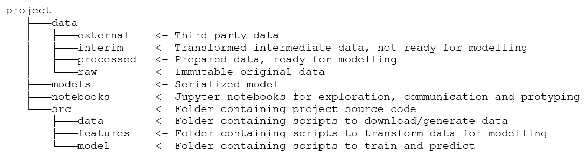

# AI model 학습 및 평가 관련 repository 입니다

> 재현성을 위해 더 나은 디렉토리 구조 있으면 알려주세요,,!<br>
> 데이터 파이프라인 구축이나 MLOps 부분 해보고 싶으시면 같이 이야기해봐도 좋을것같습니다!
>
> 진행하실 때 `python`, `numpy`, `opencv`, `langchain`등 중요한 패키지나 라이브러리는 버전 체크 꼭 해주세요!



디렉토리 구조 참고 링크: https://data-newbie.tistory.com/614

```
❯ tree
.
├── data/
├── models/             # 모델 학습을 위해 src/models의 스크립트를 사용. 배포할 모델 결정 후 해당 디렉토리에 저장
├── notebooks/          # 모델 학습 및 평가 관련 노트북 파일 저장
│   ├── PoC/
│   ├── affinity-pred/  # bio affinity prediction 관련 노트북 파일 저장
│   │   └── tmp.ipynb
│   └── paper-rag/      # paper rag 관련 노트북 파일 및 문서 저장
│       └── tmp.ipynb
└── src/                # 모델 학습 및 평가 관련 스크립트 저장
    ├── data/
    ├── feature/ # 데이터 전처리 관련 스크립트 저장
    └── models/  # 모델 학습 관련 스크립트 저장
```

### notebook 네이밍 컨벤션(참고)

```
"<step>-<user>-<descriotion>.ipnyb" (01-kpy-eda.ipynb)
```
